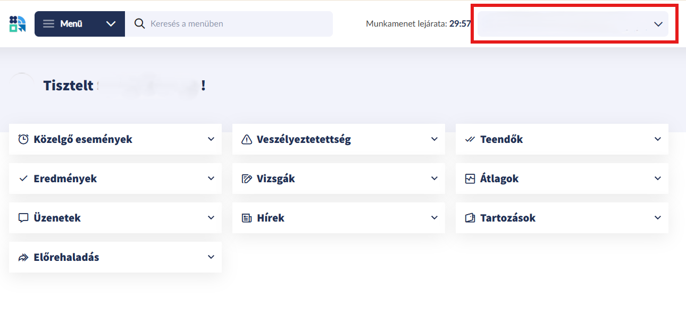
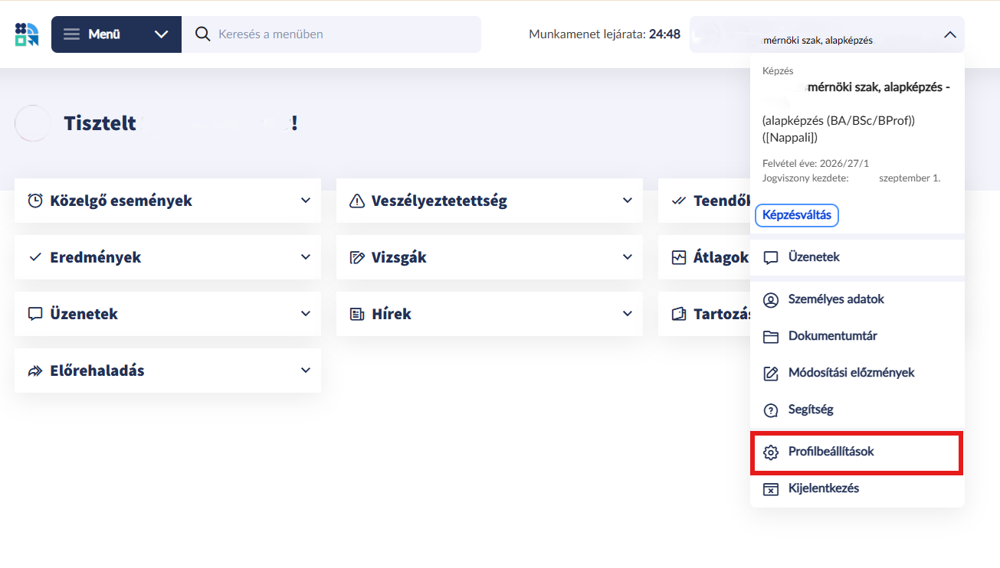
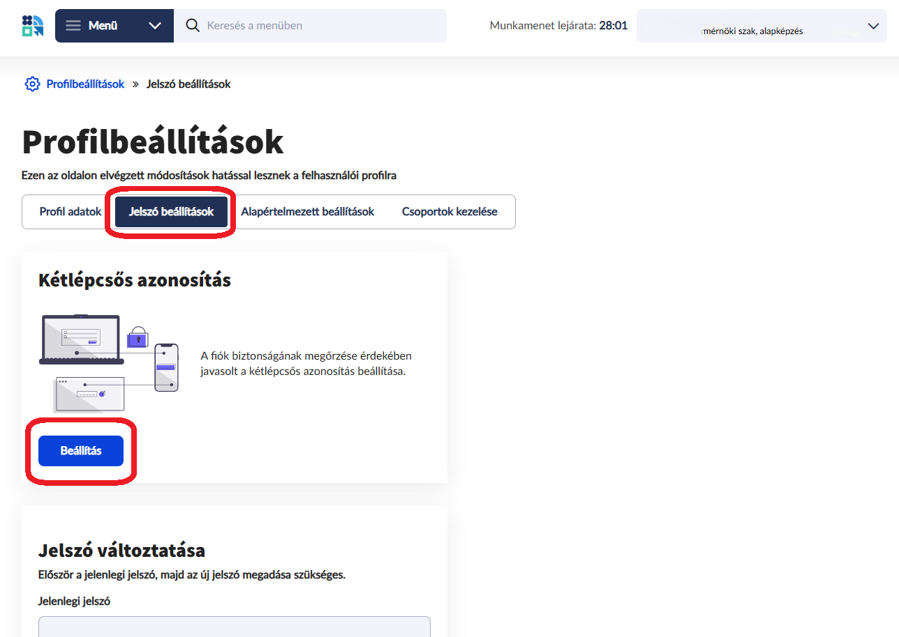
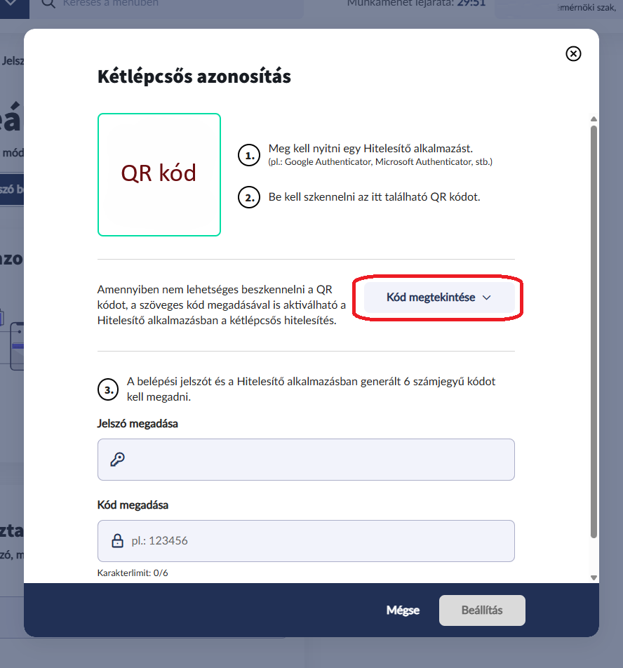
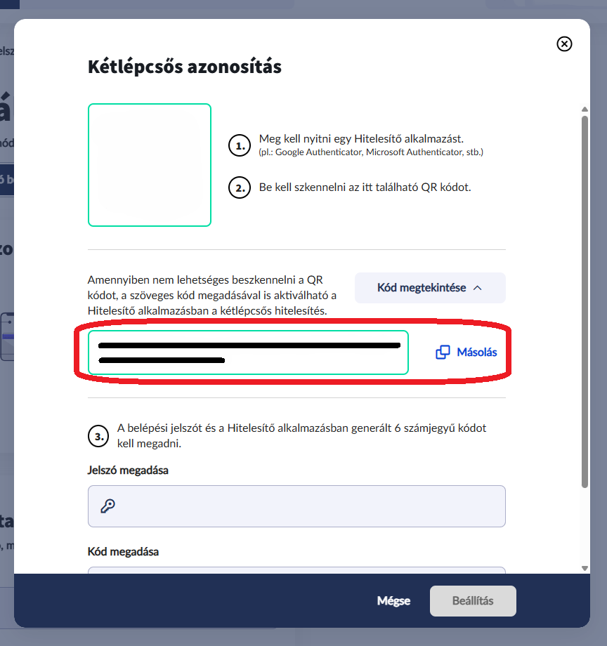
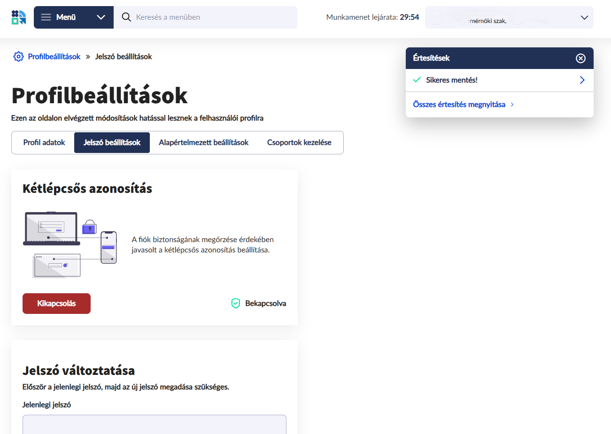

## 1. lépés
Nyisd meg a Neptunt asztali böngészőből, kattints a jobb felső profilra:

## 2. lépés
Kattints a legördülő menüből a "Profilbeállítások"-ra:

## 3. lépés
Kattints a "Jelszó beállítások"-ra, ha már be van állítva a 2 lépcsős azonosítás, akkor kapcsold ki, majd folytasd a következő lépéssel:

## 4. lépés
Szkenneld be a QR kódot az azonosító appal (Google Hitelesítő, Microsoft Authenticator...), ahogy egyébként is tennéd, majd kattints rá a "Kód megjeleítése" gombra:

## 5. lépés
Itt jön a trükk, ezt hosszú a kódot kell bemásolni a Neptunusz "2FA titkos kulcs" mezőjébe:

## 6. lépés
Fejezd be a 2 lépcsős azonosítás beállítását -ahogy egyébként is tennéd- és kész!

